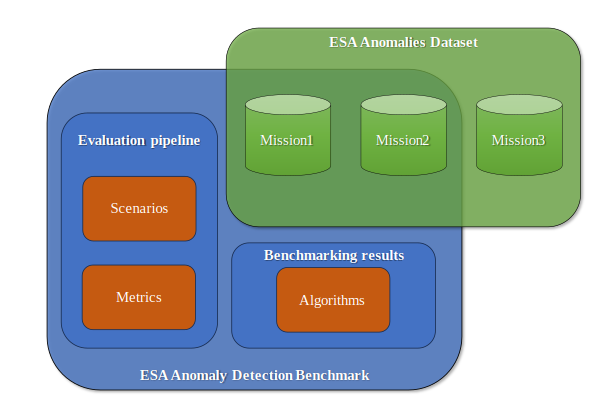

<h1>ESA Anomaly Detection Benchmark</h1>

The European Space Agency Anomaly Detection Benchmark (ESA-ADB) consists of three main components (visualised in the figure below for easier comprehension):
1.	Large-scale, curated, structured, ML-ready ESA Anomalies Dataset (ESA-AD, in short) of real-life satellite telemetry collected from three ESA missions (out of which two are selected for benchmarking in ESA-ADB), manually annotated by spacecraft operations engineers (SOEs) and ML experts, and cross-verified using state-of-the-art algorithms. It can be downloaded from here: https://doi.org/10.5281/zenodo.12528696
2.	Evaluation pipeline designed by ML experts for the practical needs of SOEs from the ESA’s European Space Operations Centre (ESOC). It introduces new metrics designed for satellite telemetry according to the latest advancements in time series anomaly detection (TSAD) and simulates real operational scenarios, e.g. different mission phases and real-time monitoring. 
3.	Benchmarking results of TSAD algorithms selected and improved to comply with the space operations requirements.

<p align="center">

</p>

We hope that this unique benchmark will allow researchers and scientists from academia, research institutes, national and international space agencies, and industry to validate models and approaches on a common baseline as well as research and develop novel, computational-efficient approaches for anomaly detection in satellite telemetry data.

The dataset results from the work of an 18-month project carried by an industry Consortium composed of Airbus Defence and Space, KP Labs, and the European Space Agency’s European Space Operations Centre. The project, funded by the European Space Agency (ESA) under the contract number 4000137682/22/D/SR, is a part of The Artificial Intelligence for Automation (A²I) Roadmap (De Canio et al., Development of an actionable AI roadmap for automating mission operations, 2023 SpaceOps Conference), a large endeavour started in 2021 to automate space operations by leveraging artificial intelligence.

The introduction below describes how to reproduce results presented in the ESA-ADB paper using the provided modified fork of the TimeEval framework.


## Initial requirements

- Some ESA-ADB functions work only on Linux (or Windows Subsystem for Linux 2), so we suggest using it as a development platform
- The hard disk must be configured to use NTFS file system
- It is recommended to have at least 512 GB free disk space to store artifacts from all experiments
- It is recommended to use Nvidia GPU with compute capability >= 7.1
- It is recommended to use a machine with at least 64 GB RAM (32 GB is an absolute minimum for the whole pipeline)

For Windows it is recommended to run the following command before cloning to prevent issues when running the docker containers: `git config --global core.autocrlf false`.
## Environment setup

### Python environment
1. Install Anaconda environment manager, version >= 22.
2. Create a conda-environment and install all required dependencies.
   Use the file [`environment.yml`](./environment.yml) for this:
   `conda env create --file environment.yml`. Note that you should **not** install TimeEval from PyPI. Our repository contains the modified version of TimeEval in the "timeeval" folder.
3. Activate the new environment `conda activate timeeval`.
4. (This step is optional and should be used only if you face any problems with "import timeeval" in your environment and you do not plan to modify the code of TimeEval. Otherwise, the recommended way is to just run scripts from the main repo folder, so our timeeval folder is directly visible to them. Another option is to add the main repo folder to the system PATH) Install the local version of TimeEval: `python setup.py install`

### Docker
1. Install Docker Engine, version >= 23.
2. Build Docker containers with algorithms of interest (e.g., listed in mission1_experiments.py) using instruction from README in the TimeEval-algorithms folder. 
   For our Telemanom-ESA, it is enough to run `sudo docker build -t registry.gitlab.hpi.de/akita/i/telemanom_esa ./telemanom_esa`.
   For our DC-VAE-ESA, it is enough to run `sudo docker build -t registry.gitlab.hpi.de/akita/i/dc_vae ./dc_vae`.

## Preparing datasets

Download raw ESA Anomalies Dataset from the link https://doi.org/10.5281/zenodo.12528696 and put ESA-Mission1 and ESA-Mission2 folders in the "data" folder.

### Generating preprocessed data for experiments

There are separate script to generate preprocessed data for TimeEval framework for each mission. The scripts are located in notebooks\data-prep folder. From the notebooks\data-prep folder run:

Mission1: 
```
python Mission1_semisupervised_prep_from_raw.py ../../data/ESA-Mission1
```
Mission2: 
```
python Mission2_semiunsupervised_prep_from_raw.py ../../data/ESA-Mission2
```

The scripts generate all necessary files to data/preprocessed/multivariate folders and add records to data/preprocessed/datasets.csv if necessary (records for ESA-ADB are already added as a part of this repository). Note that the preprocessing may take a few hours on a standard PC.

## Running experiments
There is a separate script in the main folder of the repo to run a full grid of experiments for each mission:
- Mission1: mission1_experiments.py
- Mission2: mission2_experiments.py

The scripts configure and run all algorithms in Docker containers. Results are generated to 'results' folder. On a standard PC, it may be necessary to run algorithms separately, one by one.

### Notes
- evaluation pipeline with novel time-aware metrics can only be run for datasets following the same structure as ESA Anomalies Dataset (with labels.csv and anomaly_types.csv)
- when analyzing results for different anomaly types for the lightweight subsets of channels, it is necessary to regenerate anomaly types using anomaly_types.csv using scripts/infer_anomaly_types.py. It is because anomaly types may depend on the analyzed subset of channels.
- for now, all algorithms treat rare nominal events as anomalies. To change that behaviour, it would be necessary to modify the code of the framework and some algorithms


## TimeEval
The code of the benchmark is based on the [TimeEval framework](https://github.com/TimeEval/TimeEval). Please refer to its documentation in case of any detailed questions about API. 

### TimeEval Citation

If you use TimeEval in your project or research, please cite the demonstration paper:

> Phillip Wenig, Sebastian Schmidl, and Thorsten Papenbrock.
> TimeEval: A Benchmarking Toolkit for Time Series Anomaly Detection Algorithms. PVLDB, 15(12): 3678 - 3681, 2022.
> doi:[10.14778/3554821.3554873](https://doi.org/10.14778/3554821.3554873)

```bibtex
@article{WenigEtAl2022TimeEval,
  title = {TimeEval: {{A}} Benchmarking Toolkit for Time Series Anomaly Detection Algorithms},
  author = {Wenig, Phillip and Schmidl, Sebastian and Papenbrock, Thorsten},
  date = {2022},
  journaltitle = {Proceedings of the {{VLDB Endowment}} ({{PVLDB}})},
  volume = {15},
  number = {12},
  pages = {3678--3681},
  doi = {10.14778/3554821.3554873}
}
```

## ESA-ADB Citation

If you refer to ESA-ADB in your work, please cite our paper:

> Krzysztof Kotowski, Christoph Haskamp, Jacek Andrzejewski, Bogdan Ruszczak, Jakub Nalepa, Daniel Lakey, Peter Collins, Aybike Kolmas, Mauro Bartesaghi, Jose Martínez-Heras, and Gabriele De Canio.
> European Space Agency Benchmark for Anomaly Detection in Satellite Telemetry. arXiv, 2024.
> doi:[10.48550/arXiv.2406.17826](https://doi.org/10.48550/arXiv.2406.17826)

```bibtex
@article{kotowski_european_2024,
  title = {European {Space} {Agency} {Benchmark} for {Anomaly} {Detection} in {Satellite} {Telemetry}},
  author = {Kotowski, Krzysztof and Haskamp, Christoph and Andrzejewski, Jacek and Ruszczak, Bogdan and Nalepa, Jakub and Lakey, Daniel and Collins, Peter and Kolmas, Aybike and Bartesaghi, Mauro and Martinez-Heras, Jose and De Canio, Gabriele},
  date = {2024},
  publisher = {arXiv},
  doi = {10.48550/arXiv.2406.17826}
}
```
