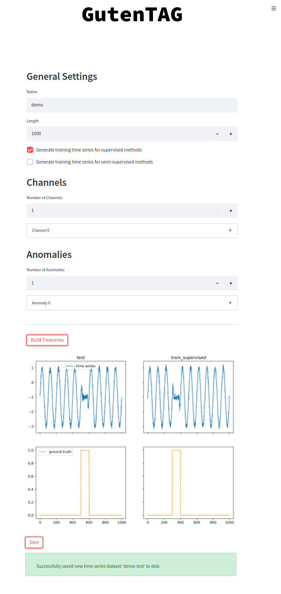
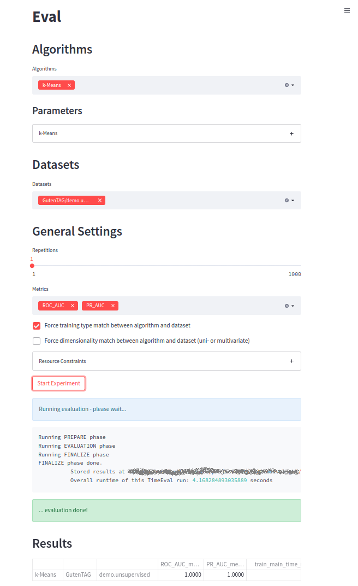
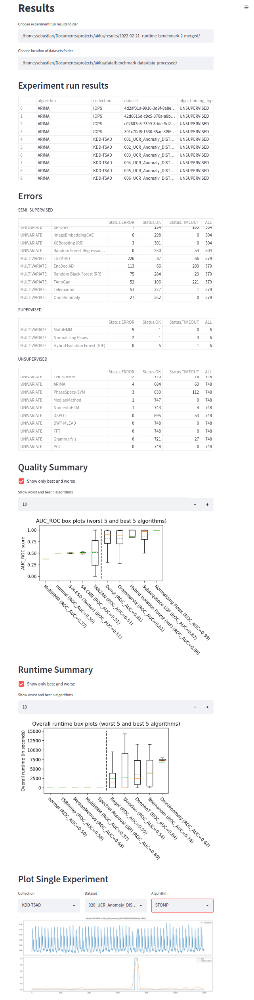

<div align="center">

<h1 align="center">TimeEval GUI / Toolkit</h1>
<p>
A Benchmarking Toolkit for Time Series Anomaly Detection Algorithms
</p>

[](https://opensource.org/licenses/MIT)


</div>

> If you use our artifacts, please consider [citing our papers](#Citation).

This repository hosts an extensible, scalable and automatic benchmarking toolkit for time series anomaly detection algorithms.
TimeEval includes an extensive data generator and supports both interactive and batch evaluation scenarios.
With our novel toolkit, we aim to ease the evaluation effort and help the community to provide more meaningful evaluations.

The following picture shows the architecture of the TimeEval Toolkit:

<div align="center">


</div>

It consists of four main components: a visual frontend for interactive experiments, the Python API to programmatically configure systematic batch experiments, the dataset generator GutenTAG, and the core evaluation engine (Time)Eval.
While the frontend is hosted in this repository, GutenTAG and Eval are hosted in separate repositories.
Those repositories also include their respective Python APIs:

[](https://github.com/HPI-Information-Systems/gutentag)
[](https://github.com/HPI-Information-Systems/timeeval)

As initial resources for evaluations, we provide over 1,000 benchmark datasets and an increasing number of time series anomaly detection algorithms (over 70): 

[](https://hpi-information-systems.github.io/timeeval-evaluation-paper/notebooks/Datasets.html)
[](https://github.com/HPI-Information-Systems/TimeEval-algorithms)

## Installation and Usage (tl;dr)

TimeEval is tested on Linux and Mac operating systems and supports Python 3.7 until 3.9.

We don't support Python 3.10 or higher at the moment because downstream libraries are incompatible.

> We haven't tested if TimeEval runs on Windows.
> If you use Windows, please help us and test if TimeEval runs correctly.
> If there are any issues, don't hesitate to contact us.

### Web frontend

```shell
# install all dependencies
make install

# execute streamlit and display frontend in default browser
make run
```

Screenshots of web frontend:





### Python APIs

Install the required components using pip:

```bash
# eval component:
pip install timeeval

# dataset generator component:
pip install timeeval-gutentag
```

For usage instructions of the respective Python APIs, please consider the project's documentation:

[](https://github.com/HPI-Information-Systems/gutentag)
[](https://github.com/HPI-Information-Systems/timeeval)

## Citation

If you use the TimeEval toolkit or any of its components in your project or research, please cite our demonstration paper:

> Phillip Wenig, Sebastian Schmidl, and Thorsten Papenbrock.
> TimeEval: A Benchmarking Toolkit for Time Series Anomaly Detection Algorithms. PVLDB, 15(12): 3678 - 3681, 2022.
> doi:[10.14778/3554821.3554873](https://doi.org/10.14778/3554821.3554873)

If you use our evaluation results or our benchmark datasets and algorithms, please cite our evaluation paper:

> Sebastian Schmidl, Phillip Wenig, and Thorsten Papenbrock.
> Anomaly Detection in Time Series: A Comprehensive Evaluation. PVLDB, 15(9): 1779 - 1797, 2022.
> doi:[10.14778/3538598.3538602](https://doi.org/10.14778/3538598.3538602)

You can use the following BibTeX entries:

```bibtex
@article{WenigEtAl2022TimeEval,
  title = {TimeEval: {{A}} Benchmarking Toolkit for Time Series Anomaly Detection Algorithms},
  author = {Wenig, Phillip and Schmidl, Sebastian and Papenbrock, Thorsten},
  date = {2022},
  journaltitle = {Proceedings of the {{VLDB Endowment}} ({{PVLDB}})},
  volume = {15},
  number = {12},
  pages = {3678--3681},
  doi = {10.14778/3554821.3554873}
}
@article{SchmidlEtAl2022Anomaly,
  title = {Anomaly Detection in Time Series: {{A}} Comprehensive Evaluation},
  author = {Schmidl, Sebastian and Wenig, Phillip and Papenbrock, Thorsten},
  date = {2022},
  journaltitle = {Proceedings of the {{VLDB Endowment}} ({{PVLDB}})},
  volume = {15},
  number = {9},
  pages = {1779--1797},
  doi = {10.14778/3538598.3538602}
}
```
